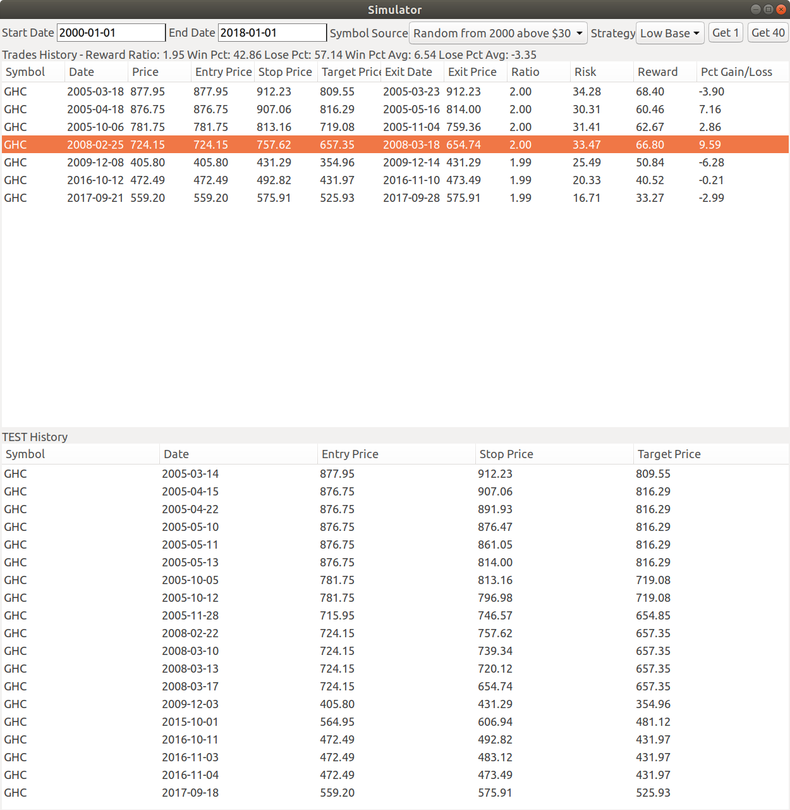
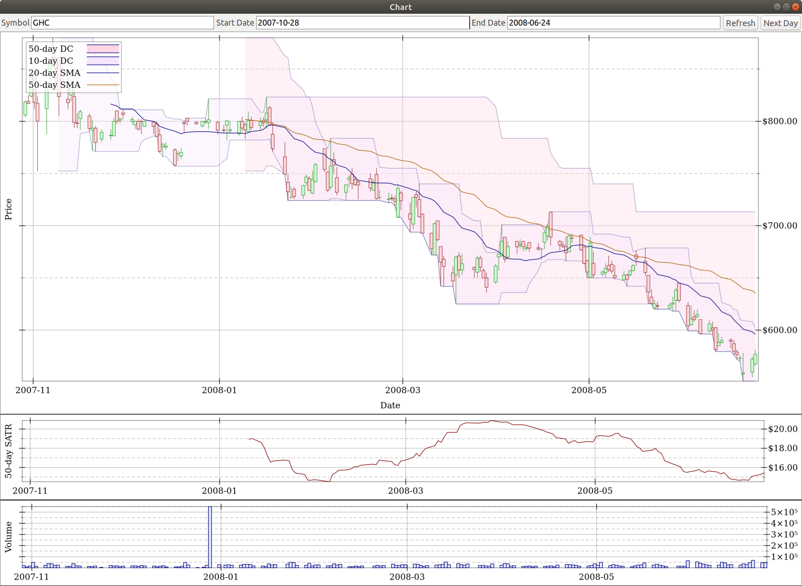

# chart-simulator

This Racket application will display stock price charts and trade simulation output. 
You can click on a trade execution pair in the simulator to view the corresponding stock chart.

Here is a sample image of the simulator:


Here is a sample image of a stock chart:


The intended way to launch this application is by doing the following:

```bash
$ racket main.rkt -u db-username -n db-name -p db-password
```

`db-username` defaults to 'user' and `db-name` defaults to local, so those arguments can be omitted if they match your database.
`db-password` must be provided.

You will need to either use data from these projects or provide a database schema that mirrors the schema provided by:
* [nasdaq-symbols](https://github.com/evdubs/nasdaq-symbols)
* [quandl-wiki-prices](https://github.com/evdubs/quandl-wiki-prices)
* [yahoo-dividends-splits](https://github.com/evdubs/yahoo-dividends-splits)

Requires Racket 7.0 or greater.
